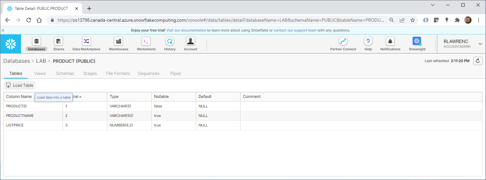

# COSC 404 - Database System Implementation Lab 9: Cloud Data Analysis with Snowflake

This lab experiments with the Snowflake cloud data analysis system.

**Note: Snowflake has recently make it harder to access the classic interface that allows easy file upload for a CSV file. To populate the data, just run the SQL DDL with insert statements available in the file: [full_order_ddl_with_inserts.ddl](data/full_order_ddl_with_inserts.ddl).**

## Data Analysis with Snowflake (10 marks)

[Snowflake](https://www.snowflake.com/) is a cloud-based data analysis system that aims to simplify common data analysis tasks often performed on-premise using data warehouses. Snowflake allows users to store data sets in the cloud to produce a data lake consisting of many different data sources. Users then perform data analysis and data engineering to generate reports and data products. Since Snowflake is a cloud service, there is no on-premise installation and maintenance. As a cloud service, users are billed based on the amount of data and compute they use when performing their activities.

In this lab, you will create a Snowflake account, load sample data into a data warehouse, execute queries using the Snowflake user interface, and execute queries using JDBC. The JUnit tests will mark your JDBC queries. There are a total of 4 queries each worth 2.5 marks.

## Getting Started

### Sign up for Snowflake Trial

Register for a free 30 day trial for Snowflake at [https://signup.snowflake.com/](https://signup.snowflake.com/). A credit card is not needed. The standard edition is sufficient. You can select any cloud provider. The screenshot below uses a Toronto data centre of Microsoft Azure.

### Initial Steps

Snowflake can be accessed using any web browser in addition to JDBC ([details](https://docs.snowflake.com/en/user-guide/setup.html)). We will start connecting to Snowflake using the user interface. 

**To connect, you need your account identifier that depends on both your user id and your cloud hosting location ([details](https://docs.snowflake.com/en/user-guide/admin-account-identifier.html)). This information will be sent to you when you register for an account.**

If you selected Microsoft Azure Toronto, then your account identifier will be: `userid.canada-central.azure`. 

Example URL: `https://userid.canada-central.azure.snowflakecomputing.com`

### User Interface

Once you login, the main user interface has links to your databases, worksheets, and dashboards. A **database** contains data stored on Snowflake. Note that each database may have multiple schemas (grouping of tables). For example, the sample TPC-H database is available as `snowflake_sample_data`. There are multiple scale factors (SF) for different database sizes. You can learn how to write queries using this sample data. Details on [using the sample data sets are available](https://docs.snowflake.com/en/user-guide/sample-data.html).

A **warehouse** is required to perform any operations on data. The list of warehouses is accessible under **Compute** then **Warehouses**. Trial accounts usually come with a created warehouse called **TESTWH**. However, if there are no warehouses defined, you can create one by clicking on the **+ Warehouse** button and then filling out the information. Use a **X-Small** warehouse to avoid using up a lot of your free credits.

The user interface also provides a list of your worksheets and dashboards. A **worksheet** is a way to generate and execute queries. A **dashboard** is used to combine multiple output charts and results into a single view. For more information, read the [quick tour of the web interface](https://docs.snowflake.com/en/user-guide/snowflake-manager.html).

The screenshot below shows a sample query on the TPCH_SF1 data set. Note to execute queries you must have created and enabled a warehouse (`COMPUTE_WH` in the image) as the warehouse performs the computation to execute the query and is how Snowflake bills users.

Try execute some SQL queries to get more familiar with the user interface.

### Loading a Data Set

There are multiple ways to load data sets into Snowflake. For our simple data set, we will use the web interface. Larger data sets can be loaded directly from cloud providers or external databases. Our data will contain order data for a small company. The first step is to create a new database called `lab`. Then use the SQL DDL provided in the file `data\order.ddl` to create the five tables (`Customer`, `Employee`, `Product`, `Orders`, `OrderedProduct`). [Documentation on loading from web interface](https://docs.snowflake.com/en/user-guide/data-load-web-ui.html).

Loading the data is done by going to the classic user interface. Click on `Databases` icon. Then find your database and the particular table. Click on the table to load then click `Load Data..` button (if on table list screen) or `Load Table` button if viewing an individual table. You will be responsible for selecting a warehouse to run the import, selecting the CSV file to import, and defining the CSV import format. At the start you will not have an input format so click on + to create a new format and enter information as shown. Then click load button to load data.

### JDBC

Snowflake can be accessed using JDBC like any other database. The lab requires you to write four SQL queries on the data set that was loaded as well as the sample TPCH_SF1 data set. These queries will be executed using Java code (`src\snowflake\Snowflake.java`). JUnit tests are in file `src\junit\TestSnowflake.java`. 

**It is suggested to write the queries using the user interface then copy them into the Java code.** This is faster and allows you more experience using the Snowflake user interface.

In our scenario, a company has bought out a smaller company and wants to produce reports on customers and orders across both organizations. The existing company database is the `TPCH_SF1` that is in the Snowflake sample data. The smaller company database is the `LAB` database loaded in the load data step.

## Next Steps

Once you have completed the lab queries, there is a lot more to Snowflake than is covered in the lab. Snowflake is used to analyze large data and produce reports and dashboards. Check out the references and the Snowflake documentation for more information.

### References

- [Using the sample data sets](https://docs.snowflake.com/en/user-guide/sample-data.html)
- [Accessing using browser or JDBC](https://docs.snowflake.com/en/user-guide/setup.html)
- [Quick tour of web interface](https://docs.snowflake.com/en/user-guide/snowflake-manager.html)
- [Snowflake in 20 Minutes](https://docs.snowflake.com/en/user-guide/getting-started-tutorial.html)
- [Loading data using web interface](https://docs.snowflake.com/en/user-guide/data-load-web-ui.html)
- [Configuring JDBC driver](https://docs.snowflake.com/en/user-guide/jdbc-configure.html)

## Submission

The lab can be marked immediately by the professor or TA by showing the output of the JUnit tests and by a quick code review.  Otherwise, submit the URL of your GitHub repository on Canvas. **Make sure to commit and push your updates to GitHub.**
